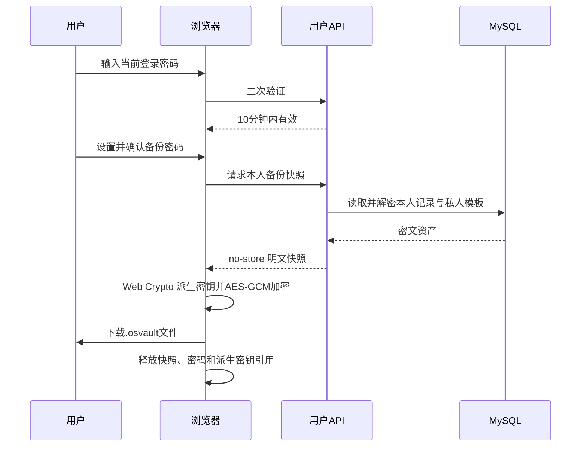

# 数据安全与恢复中心开发规格

> 状态：方案稿，待评审后拆分实施计划  
> 日期：2026-07-27  
> 产品定位：长期信任的账号资产管理工具  
> 用户入口：`/vault/security/data`  
> 管理端入口：`/admin/data-recovery`  
> 用户 API 前缀：`/api/v1/data-security`  

## 1. 背景

项目已经具备：

- Spring Boot、MySQL 8.4、Flyway 和 Docker Compose 生产部署基础。
- 账密记录、私人模板的用户隔离。
- 服务端 AES-256-GCM 加密存储。
- 密文随机 nonce、`key_id`、算法版本和载荷版本。
- 账密记录与私人模板软删除字段 `deleted_at`。
- 用户 Markdown 明文导出。
- 用户安全中心、登录设备管理、安全日志与白名单系统设置。

但当前“可恢复性”仍有明显缺口：

1. 软删除记录无法从页面恢复，也无法主动永久删除。
2. Markdown 导出是明文文件，不适合作为长期安全备份。
3. 没有可验证、可合并恢复的版本化备份格式。
4. `key_id` 虽已入库，但服务端只能加载一把密钥，尚不支持历史密钥读取和真正的密钥轮换。
5. 生产 Compose 只有 MySQL 数据卷，没有已落地的离站备份任务与恢复演练。
6. 数据库备份与应用加密密钥尚未形成成套、分权的恢复资产。
7. 管理端没有灾备状态，但也不能因此获得查看或下载用户账密的能力。

本模块需要同时回答两个问题：

- 用户误删或更换环境后，如何安全恢复自己的账密资产？
- 系统发生主机、数据库或版本事故后，运维如何恢复服务且不突破用户隐私边界？

## 2. 现状基线与冲突

### 2.1 当前加密模型

当前保险箱采用服务端加密：

```text
浏览器明文业务 DTO
        │ HTTPS
        ▼
已认证用户 API
        │ schema 与租户校验
        ▼
AES-256-GCM + 随机 nonce + AAD
        │
        ▼
MySQL 密文
```

AAD 当前绑定：

```text
ownerId | entityType | entityId | payloadVersion
```

因此，不能把数据库中的某段密文直接复制给另一个用户。只要 `ownerId` 或 `entityId` 变化，原密文认证就会失败。跨账号恢复必须先在受控服务中解密，再用目标用户和新实体 ID 重新加密。

### 2.2 已失效的旧设计

原始 PRD 中关于客户端 DEK、恢复密钥、密钥信封以及密码重置清空保险箱的描述已经失效。本规格以当前服务端加密代码和架构决策为准：

- 登录密码与保险箱加密密钥脱钩。
- 用户不持有服务端 Vault 主密钥。
- 重置登录密码保留保险箱数据。
- 管理员不能读取用户保险箱明文。

### 2.3 当前部署差异

部署文档要求数据库不映射宿主机端口，但当前 `deploy/compose.yml` 仍存在：

```yaml
ports:
  - "3306:3306"
```

进入系统灾备实施阶段前，应先移除生产 MySQL 主机端口映射，只允许内部网络和受控运维命令访问。

## 3. 产品范围

数据安全与恢复中心分为三层。

| 层级 | 面向对象 | 主要能力 |
| --- | --- | --- |
| 个人数据恢复 | 普通用户 | 回收站、本地加密备份、备份预检、安全合并恢复、数据健康状态 |
| 系统灾难恢复 | 管理员与运维 | 备份健康状态、离站数据库备份、恢复演练、RPO/RTO |
| 密钥生命周期 | 运维与后端 | 多密钥读取、当前写密钥、批量重加密、历史密钥退出 |

## 4. 目标

1. 用户误删账密或私人模板后，可以在保留期内恢复。
2. 用户可以生成具有独立备份密码的 `.osvault` 加密备份。
3. 用户可以在当前账号或新账号中预检并安全合并备份。
4. 恢复过程不会覆盖现有账密，不会产生跨用户越权。
5. 数据库中继续只保存保险箱密文。
6. 备份、恢复、永久删除和完整性检查均可审计，但日志不包含账密内容。
7. 数据库与历史 Vault 密钥具备成套、分权的离站恢复能力。
8. 管理员能判断灾备是否健康，但不能在线下载备份或读取用户内容。

## 5. 非目标

第一版不包含：

- 管理员代替用户查看、导出或恢复具体账密。
- Web 后台“一键覆盖生产数据库”。
- 云端保存用户 `.osvault` 文件。
- 多人共享保险箱或团队级恢复审批。
- 记录级历史版本时间轴。
- 自动覆盖当前已有记录。
- 从 Markdown、CSV、Excel 直接恢复。
- 账号注销与用户数据整体销毁。
- 浏览器指纹、精确位置或完整 IP 采集。
- 对 JavaScript 内存“绝对擦除”的安全承诺。

## 6. 角色与权限边界

### 6.1 普通用户

普通用户可以：

- 查看自己的数据安全摘要。
- 查看、搜索自己的回收站。
- 恢复自己的软删除记录和私人模板。
- 永久删除自己的回收站资产。
- 生成自己的加密备份。
- 预检并恢复自己持有的有效 `.osvault` 文件。
- 查看自己的恢复操作结果。

普通用户不能：

- 查看其他用户的回收站或恢复记录。
- 直接读取数据库密文或 Vault 主密钥。
- 指定恢复目标用户。
- 通过备份文件覆盖当前已有记录。

### 6.2 管理员

管理员只能查看：

- 最近一次系统备份状态和时间。
- 备份距今天数、备份大小和校验状态。
- 最近一次隔离恢复演练时间。
- 当前是否存在缺失密钥版本、完整性失败或演练逾期告警。
- 聚合数量，例如受影响用户数、失败密文数。

管理员不能：

- 下载系统数据库备份。
- 查看备份对象存储路径、临时签名地址或密钥材料。
- 查看用户 `.osvault` 文件。
- 发起某个用户的账密导出或恢复。
- 在线执行生产覆盖恢复。
- 查看完整 IP、原始 User-Agent 或账密字段。

### 6.3 运维人员

系统级恢复属于受保护运维操作：

- 通过 SSH 密钥、受限部署账号和独立密钥保管渠道执行。
- 必须先恢复到隔离环境。
- 验证应用版本、Flyway 版本、数据库完整性和所需 `key_id`。
- 完成验收并得到人工批准后，才能进入生产恢复窗口。

## 7. 信息架构

### 7.1 用户端

保留现有一级入口“安全设置”，在安全中心内部提供二级导航：

```text
安全中心
├── 登录设备
└── 数据安全与恢复
```

路由：

| 页面 | 路由 |
| --- | --- |
| 登录设备 | `/vault/security` |
| 数据安全与恢复 | `/vault/security/data` |

不向手机底栏新增第五个入口，避免主导航继续膨胀。

### 7.2 管理端

新增管理端一级页面：

```text
系统管理
└── 数据恢复
```

路由：

```text
/admin/data-recovery
```

页面只显示灾备元数据和操作规范，不显示下载或恢复生产按钮。

## 8. 用户页面结构

### 8.1 安全摘要

顶部显示三个摘要卡：

| 卡片 | 内容 |
| --- | --- |
| 加密状态 | 服务端加密正常 / 密钥版本异常 / 待检查 |
| 最近备份 | 最近一次生成加密备份的时间；没有时提示“尚未创建” |
| 回收站 | 待恢复资产数量和最近到期时间 |

这里的“最近备份”表示用户成功生成过备份快照，不承诺浏览器最终文件仍存在。

### 8.2 加密备份

操作：

- 创建加密备份。
- 从备份恢复。
- 查看格式说明和安全提示。

现有 Markdown 导出继续保留，并明确标注为“明文导出，便于人工阅读”；`.osvault` 标注为“加密备份，可用于恢复”。两者不能混用，第一版也不支持从 Markdown 恢复。

固定提示：

> 备份文件由你设置的独立备份密码加密。系统不会保存该密码，遗失后无法找回。

### 8.3 回收站

列表字段：

- 资产名称。
- 类型：账密记录 / 私人模板。
- 平台或渠道摘要。
- 删除时间。
- 剩余保留天数。
- 操作：恢复、永久删除。

列表支持：

- 搜索名称、平台或渠道。
- 类型筛选。
- 刷新。
- 清空回收站。

手机端遵循 `docs/Design.md` §7.1：

- 第一行搜索 + 筛选/刷新工具钮。
- “清空回收站”危险操作单独换行。
- 使用 `useMobileInfiniteScroll`，隐藏分页器。
- 恢复预检和长结果使用全屏任务层。

## 9. 二次验证

### 9.1 原因

当前项目只有持续登录会话，没有通用的登录后再次验证能力。以下操作会导出或永久改变敏感数据，不能只依赖旧登录会话：

- 创建加密备份快照。
- 开始批量恢复。
- 永久删除单条回收站资产。
- 清空回收站。

### 9.2 方案

新增：

```http
POST /api/v1/security/reauth
Content-Type: application/json

{
  "password": "当前登录密码"
}
```

验证成功后仅在当前 Spring Session 写入：

```text
os.security.reauthenticatedAt
```

服务端返回：

```json
{
  "verifiedUntil": "2026-07-27T12:10:00Z"
}
```

规则：

- 有效期 10 分钟。
- 不向前端返回长期二次验证令牌。
- 修改密码、重置密码、退出当前会话或会话被撤销后立即失效。
- 连续失败需要限流，建议同一用户和客户端上下文 15 分钟最多 5 次。
- 成功和失败都进入安全日志，但不记录密码。

恢复单条软删除资产不要求再次验证，因为它不会泄露文件或永久销毁数据。

## 10. 回收站设计

### 10.1 复用现有数据

继续使用：

- `vault_item.deleted_at`
- `private_template.deleted_at`

实体增加领域方法：

```java
restore();
```

恢复时将 `deleted_at` 设为 `NULL`，保留原 ID、创建时间和密文，不需要重新加密。

### 10.2 保留期限

新增白名单系统设置：

```text
security.recycle_bin_retention_days
```

| 属性 | 值 |
| --- | --- |
| 默认值 | 30 天 |
| 可选值 | 7 / 30 / 90 天 |
| 风险级别 | HIGH |
| 设置分组 | DATA_SECURITY |

降低保留期限时：

- 不在管理员保存设置的事务中直接删除数据。
- 设置页必须预览影响范围。
- 定时清理任务按新期限执行。
- 管理员看不到将被清理的用户资产名称。

### 10.3 自动清理

新增：

```java
VaultTrashRetentionJob
```

建议每天 `04:10` 执行，避开 `03:30` 安全日志清理。

规则：

1. 读取不到保留期限时跳过删除。
2. 每批最多删除 500 条。
3. 只删除 `deleted_at < cutoff` 的软删除资产。
4. 账密记录与私人模板分别处理。
5. 单批事务失败时回滚该批，保留原数据。
6. 日志和审计只记录删除数量与截止时间。

## 11. 用户加密备份格式

### 11.1 文件名

```text
online-safe-backup-20260727-203015.osvault
```

### 11.2 外层信封

外层不包含用户名称、手机号、记录名、平台或字段值：

```json
{
  "format": "online-safe-vault-backup",
  "formatVersion": 1,
  "kdf": {
    "name": "PBKDF2-SHA-256",
    "iterations": 600000,
    "salt": "Base64"
  },
  "cipher": {
    "name": "AES-256-GCM",
    "iv": "Base64"
  },
  "ciphertext": "Base64"
}
```

格式规则：

- 备份密码最少 12 位。
- salt 每次随机生成，至少 16 字节。
- IV 每次随机生成 12 字节。
- 派生 256-bit AES 密钥。
- KDF 参数写入文件，便于未来格式升级。
- 第一版不压缩，避免额外兼容性和解压资源攻击面。
- 文件扩展名固定 `.osvault`。

KDF 次数需要在目标手机与桌面浏览器做性能基准；600000 是初始实现值，若调整必须通过新文件头参数兼容旧文件，不能静默改变旧格式解释。

### 11.3 内层清单

AES-GCM 解密后的 JSON：

```json
{
  "backupId": "uuid",
  "schemaVersion": 1,
  "createdAt": "2026-07-27T12:00:00Z",
  "source": {
    "application": "online-safe",
    "applicationVersion": "git-version",
    "accountId": "uuid"
  },
  "scope": {
    "includesTrash": true
  },
  "items": [
    {
      "id": "uuid",
      "payload": {},
      "revision": 3,
      "createdAt": "2026-07-01T12:00:00Z",
      "updatedAt": "2026-07-20T12:00:00Z",
      "deletedAt": null
    }
  ],
  "privateTemplates": []
}
```

说明：

- `accountId` 位于加密内层，只用于冲突判断和操作说明。
- 记录 payload 使用现有业务 schema。
- 系统模板不进入备份。
- 记录自身已有 `templateSnapshot` 时随 payload 一起保存。
- 默认同时备份回收站内容，但恢复时不会默认复活已删除资产。

### 11.4 导出流程



服务端响应必须带：

```http
Cache-Control: no-store, no-cache, must-revalidate
Pragma: no-cache
```

## 12. 恢复策略

### 12.1 第一版只允许安全合并

禁止提供：

- 覆盖整个保险箱。
- 自动以备份覆盖更新记录。
- 先清空现有数据再恢复。

每条资产的处理规则：

| 当前状态 | 恢复动作 |
| --- | --- |
| 当前用户不存在该 ID | 创建；如全局 ID 可用则保留，否则生成新 UUID |
| 当前用户同 ID 为软删除 | 恢复并以备份 payload 重新加密 |
| 当前用户同 ID 为活跃 | 跳过，标记冲突 |
| 该 ID 属于其他用户 | 生成新 UUID，按当前用户重新加密 |
| payload schema 不合法 | 拒绝该条并返回安全错误码 |
| 备份中为已删除状态 | 默认不恢复；用户明确勾选后才进入回收站 |

所有写入都使用当前写密钥，不直接把备份中的业务 JSON或旧数据库密文原样写库。

### 12.2 恢复步骤

1. 选择 `.osvault` 文件。
2. 检查扩展名、大小、外层 JSON 深度和字段白名单。
3. 用户输入备份密码。
4. 浏览器本地执行 AES-GCM 解密。
5. 使用 Zod 校验内层 schema、数量、字符串长度和字段上限。
6. 展示创建、跳过冲突、回收站资产和无效资产数量。
7. 用户完成当前登录密码二次验证。
8. 使用 `OsConfirmDialog` 确认安全合并。
9. 每 100 条提交一个幂等批次。
10. 服务端再次执行租户、UUID、payload 和字段限制校验。
11. 服务端使用当前 Vault 写密钥加密后提交。
12. 展示恢复结果，并刷新保险箱、模板和回收站。

### 12.3 文件限制

第一版建议：

| 限制 | 值 |
| --- | --- |
| 加密文件最大 | 20 MiB |
| 账密记录最大 | 5000 |
| 私人模板最大 | 500 |
| 单批恢复 | 100 |
| JSON 最大嵌套深度 | 20 |
| 单字段值 | 沿用现有 Vault schema 上限 |
| 同用户同时恢复操作 | 1 |

这些属于后端部署配置，不开放在线修改。

## 13. 恢复幂等与并发

### 13.1 操作 ID

创建恢复任务后返回 `operationId`。每批使用：

```text
operationId + batchNo
```

作为幂等键。

重复提交已成功批次时返回原计数，不重复创建资产。

### 13.2 并发规则

- 同一用户同一时间只能有一个 `RUNNING` 恢复操作。
- 恢复期间仍可查看保险箱，但前端提示“正在恢复数据”。
- 用户手动编辑与恢复写入同 ID 活跃记录冲突时，恢复始终跳过，绝不覆盖。
- 批次事务相互独立，已成功批次不会因后续失败回滚。
- 中断后可在 24 小时内继续未提交批次。
- 超过 24 小时未完成的任务标记 `EXPIRED`，已恢复数据保留。

## 14. 数据模型

当前最新迁移为 V17。若实施时没有并行迁移，建议新增：

```text
V18__create_data_recovery_operation.sql
```

### 14.1 `data_recovery_operation`

| 字段 | 类型 | 说明 |
| --- | --- | --- |
| `id` | CHAR(36) | 操作 ID |
| `owner_id` | CHAR(36), NULL | 用户操作时为用户 ID；系统任务为空 |
| `scope` | VARCHAR(16) | USER / SYSTEM |
| `operation_type` | VARCHAR(40) | 操作类型 |
| `status` | VARCHAR(20) | CREATED / RUNNING / SUCCEEDED / PARTIAL / FAILED / EXPIRED |
| `format_version` | INT, NULL | 用户备份格式版本 |
| `source_backup_id` | CHAR(36), NULL | 加密清单内的备份 ID |
| `total_count` | INT | 计划处理数量 |
| `processed_count` | INT | 已处理数量 |
| `created_count` | INT | 新建数量 |
| `restored_count` | INT | 从回收站恢复数量 |
| `skipped_count` | INT | 冲突跳过数量 |
| `failed_count` | INT | 失败数量 |
| `error_code` | VARCHAR(64), NULL | 安全错误码 |
| `started_at` | DATETIME(6), NULL | 开始时间 |
| `finished_at` | DATETIME(6), NULL | 完成时间 |
| `expires_at` | DATETIME(6), NULL | 可续传截止 |
| `created_at` | DATETIME(6) | 创建时间 |
| `updated_at` | DATETIME(6) | 更新时间 |
| `version` | BIGINT | 乐观锁 |

禁止保存：

- 备份密码。
- 文件名和本地路径。
- 记录名称、平台、账号、密码、备注。
- payload、密文、nonce 或 Vault 密钥。
- 完整 IP 和原始 User-Agent。

### 14.2 `data_recovery_batch`

| 字段 | 类型 | 说明 |
| --- | --- | --- |
| `operation_id` | CHAR(36) | 所属恢复任务 |
| `batch_no` | INT | 批次号 |
| `status` | VARCHAR(20) | RUNNING / SUCCEEDED / FAILED |
| `entry_count` | INT | 本批数量 |
| `created_count` | INT | 新建数量 |
| `restored_count` | INT | 恢复数量 |
| `skipped_count` | INT | 跳过数量 |
| `failed_count` | INT | 失败数量 |
| `error_code` | VARCHAR(64), NULL | 安全错误码 |
| `created_at` | DATETIME(6) | 创建时间 |
| `finished_at` | DATETIME(6), NULL | 完成时间 |

主键：

```text
(operation_id, batch_no)
```

表中不保存批次业务内容。

### 14.3 现有表调整

`vault_item` 与 `private_template` 不需要为回收站新增字段。

仓储需要增加：

- 按 owner 和 `deleted_at is not null` 查询。
- 恢复指定 owner 的软删除资产。
- 按 owner、ID 查询包含软删除的资产。
- 按截止时间分批永久删除。
- 回收站数量和最早到期时间统计。

## 15. 用户 API

### 15.1 数据安全摘要

```http
GET /api/v1/data-security/summary
```

响应：

```json
{
  "encryption": {
    "status": "HEALTHY",
    "lastCheckedAt": "2026-07-27T11:00:00Z"
  },
  "backup": {
    "lastSnapshotAt": "2026-07-20T09:30:00Z"
  },
  "trash": {
    "itemCount": 3,
    "templateCount": 1,
    "nearestPurgeAt": "2026-08-01T10:00:00Z",
    "retentionDays": 30
  }
}
```

不返回其他用户或系统备份信息。

### 15.2 回收站列表

```http
GET /api/v1/data-security/trash?keyword=&type=ALL&page=0&size=20
```

`type`：

- `ALL`
- `ITEM`
- `PRIVATE_TEMPLATE`

响应只包含页面展示需要的摘要，不返回敏感字段值。

### 15.3 恢复单条

```http
POST /api/v1/data-security/trash/{type}/{id}/restore
```

成功：

```http
204 No Content
```

### 15.4 永久删除单条

```http
DELETE /api/v1/data-security/trash/{type}/{id}
```

要求：

- 最近 10 分钟完成二次验证。
- `OsConfirmDialog` 使用 `danger`。
- 对不存在或不属于当前用户的 ID 统一返回 204，防止枚举。

### 15.5 清空回收站

```http
POST /api/v1/data-security/trash/purge
```

响应：

```json
{
  "deletedItems": 3,
  "deletedTemplates": 1
}
```

### 15.6 创建备份快照

```http
POST /api/v1/data-security/backup-snapshots
Content-Type: application/json

{
  "includeTrash": true
}
```

要求：

- 最近 10 分钟完成二次验证。
- 只返回当前用户资产。
- 响应 `Cache-Control: no-store`。
- 安全日志记录数量和格式版本，不记录内容。

### 15.7 恢复预检

```http
POST /api/v1/data-security/restores/preflight
```

只提交类型、源 ID、删除状态和必要版本元数据，不提交字段值。服务端返回：

- `CREATE`
- `RESTORE_DELETED`
- `SKIP_ACTIVE_CONFLICT`
- `REASSIGN_ID`
- `INVALID`

预检结果仅供展示，正式写入时必须重新判断。

### 15.8 创建恢复操作

```http
POST /api/v1/data-security/restore-operations
```

要求最近 10 分钟完成二次验证。

### 15.9 提交恢复批次

```http
PUT /api/v1/data-security/restore-operations/{operationId}/batches/{batchNo}
```

每批最多 100 条。请求正文中的 payload 只用于当前事务校验与加密，不写入操作表、缓存或日志。

### 15.10 完成恢复

```http
POST /api/v1/data-security/restore-operations/{operationId}/complete
```

### 15.11 查询恢复进度

```http
GET /api/v1/data-security/restore-operations/{operationId}
```

用户只能查询自己的操作。

## 16. 管理端 API

### 16.1 灾备摘要

```http
GET /api/admin/data-recovery/summary
```

返回：

- 最近备份状态、时间、年龄和大小。
- 最近一次校验结果。
- 最近一次恢复演练时间。
- RPO/RTO 目标。
- 当前密钥版本数量和缺失引用数量。
- 聚合完整性异常数量。

不返回：

- Bucket 名、对象 Key、下载地址。
- 数据库名、数据库账号。
- Vault 密钥。
- 用户记录名称或字段。

### 16.2 历史记录

```http
GET /api/admin/data-recovery/runs?page=0&size=20&type=&status=
```

该页面使用手机端无限滚动，桌面端分页。

Web 后台不提供系统恢复执行接口。

## 17. 后端模块建议

新增模块：

```text
backend/src/main/java/com/godlei/onlinesafe/datarecovery/
├── application/
│   ├── DataSecuritySummaryService.java
│   ├── VaultBackupSnapshotService.java
│   ├── VaultRestoreService.java
│   ├── VaultTrashService.java
│   ├── VaultTrashRetentionJob.java
│   ├── VaultIntegrityScanService.java
│   └── RecentReauthenticationService.java
├── domain/
│   ├── DataRecoveryOperation.java
│   ├── DataRecoveryBatch.java
│   ├── RecoveryOperationStatus.java
│   └── RecoveryOperationType.java
├── infrastructure/
│   ├── DataRecoveryOperationRepository.java
│   ├── DataRecoveryBatchRepository.java
│   └── BackupStatusReader.java
└── web/
    ├── DataSecurityController.java
    ├── VaultTrashController.java
    ├── VaultBackupController.java
    ├── VaultRestoreController.java
    └── DataRecoveryAdminController.java
```

前端新增：

```text
frontend/src/
├── api/dataSecurity.ts
├── domain/vaultBackupEnvelope.ts
├── domain/vaultBackupCrypto.ts
├── stores/dataRecovery.ts
├── views/vault/VaultDataSecurityView.vue
├── views/admin/AdminDataRecoveryView.vue
└── components/data-recovery/
    ├── BackupCreateDialog.vue
    ├── BackupRestoreDialog.vue
    ├── RecoveryPreview.vue
    └── TrashAssetList.vue
```

## 18. Vault 密钥环与轮换

### 18.1 必须先改造的问题

当前 `VaultPayloadCipher` 只有一把 `SecretKey`，并要求：

```text
记录 key_id == currentKeyId
```

这会导致切换 `currentKeyId` 后旧记录无法解密。上线恢复中心前，至少需要改造成：

```java
VaultKeyRing {
    int currentKeyId();
    SecretKey requireKey(int keyId);
}
```

加密使用当前写密钥；解密按记录 `key_id` 选择历史密钥。

### 18.2 密钥配置

推荐从服务器只读 Secret 文件加载密钥环，不把真实值写入 Git、数据库或在线系统设置：

```json
{
  "currentKeyId": 2,
  "keys": {
    "1": "Base64-32-bytes",
    "2": "Base64-32-bytes"
  }
}
```

文件：

- 权限仅部署账号和后端容器可读。
- 生产容器只读挂载。
- 与数据库备份使用不同权限域保存副本。
- 日志只记录 key ID，不记录密钥值。

### 18.3 轮换流程

1. 生成新密钥并加入密钥环。
2. 保留旧密钥，将 `currentKeyId` 切换到新 ID。
3. 新写入立即使用新密钥。
4. 后台按 owner 和主键顺序分批读取旧密钥记录。
5. 解密、校验、用新密钥重新加密。
6. 记录成功、失败和剩余数量，不记录 payload。
7. 全量完成后进行完整性扫描。
8. 至少跨过全部系统备份保留周期后，才能评审移除旧密钥。

任何时候都不能先删除旧密钥再重加密数据。

## 19. 完整性检查

### 19.1 检查内容

对账密记录和私人模板检查：

- `algo_version` 是否支持。
- `payload_version` 是否支持。
- `key_id` 是否存在。
- nonce 长度是否合法。
- AES-GCM 标签是否验证通过。
- 解密 JSON 是否符合当前 schema。
- owner、实体类型和 ID 的 AAD 是否匹配。

### 19.2 结果

用户只看到：

- 正常。
- 部分数据需要处理。
- 尚未检查。

管理员只看到聚合：

- 缺失密钥版本数。
- 解密失败记录数。
- 受影响用户数。

系统不得自动删除完整性失败的资产。

### 19.3 执行策略

- 每日低峰期增量检查近期修改资产。
- 密钥轮换和系统恢复演练后执行全量检查。
- 用户手动检查需要限流，例如每 24 小时一次。
- 检查过程不得把解密内容写入日志。

## 20. 系统灾难恢复

### 20.1 初始目标

| 指标 | 第一阶段目标 |
| --- | --- |
| RPO | 24 小时 |
| RTO | 4 小时 |
| 日备 | 7 份 |
| 周备 | 4 份 |
| 月备 | 3 份 |
| 恢复演练 | 每月至少 1 次 |

### 20.2 必须备份的资产

数据库侧：

- MySQL 全库逻辑备份。
- Flyway 历史表。
- Spring Session 可以包含在备份中，但恢复到新环境后建议主动清理并要求重新登录。

应用侧：

- 发布版本或镜像摘要。
- Caddy、Compose 和非敏感配置版本。
- Vault 密钥环。
- 邀请码加密密钥。
- 审计指纹密钥。

外部对象：

- 用户头像对象。
- 未来的私有备份状态或其他持久对象。

### 20.3 分权原则

数据库备份和 Vault 密钥环必须：

- 分别加密。
- 使用不同凭据。
- 保存到不同权限域。
- 恢复时通过双人或双渠道取得。

不得将数据库备份、`.env` 和 Vault 密钥打入同一个压缩包。

### 20.4 备份任务

建议由独立备份 Agent 或宿主机受控任务完成，而不是由 Web 请求触发：

1. 使用专用只读/备份数据库账号。
2. 生成一致性逻辑备份。
3. 加密后上传主机外私有存储。
4. 重新下载小样或读取远端元数据进行校验。
5. 写入不含路径与凭据的状态记录。
6. 应用保留策略。
7. 失败时产生高风险告警。

对象存储必须使用独立 `BackupObjectStorage` 语义和最小权限凭据，禁止复用公开头像 Bucket 与 URL。

备份 Agent 只通过内部状态上报接口写入安全元数据：

```http
POST /internal/v1/backup-runs
```

请求只允许包含：

- 唯一 `runId`。
- 开始和结束时间。
- 成功、失败或校验失败状态。
- 加密备份大小。
- 校验是否通过。
- 安全错误码。

接口要求：

- 只在 Docker `internal` 网络可达，Caddy 不代理 `/internal/**`。
- 使用独立 `BACKUP_REPORT_KEY` 做 HMAC 请求签名。
- 签名覆盖时间戳、随机 nonce 和请求体摘要。
- 请求时间偏差不得超过 5 分钟。
- `runId` 幂等，防止重复上报。
- 不接受对象 Key、下载 URL、数据库凭据或任何用户内容。

### 20.5 恢复演练


演练要求：

- 禁止连接生产短信、公开 COS 写权限或真实外部回调。
- 不在截图、工单或日志中展示账密明文。
- 使用受控测试账号验证；不随机打开用户记录。
- 演练结束后销毁临时数据库、容器和临时密钥挂载。

## 21. 安全日志

建议新增事件：

| 事件 | 风险 | 允许元数据 |
| --- | --- | --- |
| `USER_REAUTH_SUCCEEDED` | INFO | 无 |
| `USER_REAUTH_FAILED` | WARNING | `reason` |
| `USER_BACKUP_SNAPSHOT_CREATED` | WARNING | `itemCount`, `templateCount`, `includesTrash`, `formatVersion` |
| `USER_BACKUP_RESTORE_STARTED` | WARNING | `totalCount`, `formatVersion` |
| `USER_BACKUP_RESTORE_SUCCEEDED` | WARNING | `createdCount`, `restoredCount`, `skippedCount` |
| `USER_BACKUP_RESTORE_FAILED` | HIGH | `errorCode`, `processedCount` |
| `USER_TRASH_ASSET_RESTORED` | INFO | `assetType` |
| `USER_TRASH_ASSET_PURGED` | HIGH | `assetType` |
| `USER_TRASH_EMPTIED` | HIGH | `itemCount`, `templateCount` |
| `VAULT_TRASH_PURGE_SUCCEEDED` | INFO | `deletedCount`, `cutoffAt` |
| `VAULT_TRASH_PURGE_FAILED` | HIGH | `errorCode` |
| `VAULT_INTEGRITY_SCAN_SUCCEEDED` | INFO | `checkedCount`, `failedCount` |
| `VAULT_INTEGRITY_SCAN_FAILED` | HIGH | `errorCode` |
| `SYSTEM_BACKUP_SUCCEEDED` | INFO | `sizeBytes`, `durationSeconds` |
| `SYSTEM_BACKUP_FAILED` | HIGH | `errorCode` |
| `SYSTEM_RESTORE_DRILL_SUCCEEDED` | INFO | `durationSeconds` |
| `SYSTEM_RESTORE_DRILL_FAILED` | HIGH | `errorCode` |

禁止进入审计元数据：

- 记录 ID、记录名、平台、账号、密码和字段值。
- 文件名、本地路径、对象 Key 和下载 URL。
- 备份密码、Vault 密钥和数据库凭据。
- 完整 IP 与原始 User-Agent。

## 22. 错误码

| HTTP | 错误码 | 中文提示 |
| --- | --- | --- |
| 400 | `BACKUP_FILE_INVALID` | 备份文件格式不正确 |
| 400 | `BACKUP_VERSION_UNSUPPORTED` | 暂不支持该备份版本 |
| 400 | `BACKUP_PASSWORD_INVALID` | 备份密码不正确或文件已损坏 |
| 400 | `BACKUP_SCHEMA_INVALID` | 备份内容校验失败 |
| 400 | `BACKUP_LIMIT_EXCEEDED` | 备份内容超过允许范围 |
| 401 | `REAUTH_REQUIRED` | 请再次验证登录密码 |
| 401 | `REAUTH_FAILED` | 登录密码不正确 |
| 404 | `TRASH_ASSET_NOT_FOUND` | 回收站中没有找到该数据 |
| 409 | `RESTORE_ALREADY_RUNNING` | 当前已有恢复任务正在执行 |
| 409 | `RESTORE_OPERATION_EXPIRED` | 恢复任务已过期，请重新导入 |
| 409 | `RESTORE_BATCH_CONFLICT` | 恢复批次状态冲突 |
| 413 | `BACKUP_FILE_TOO_LARGE` | 备份文件过大 |
| 422 | `VAULT_KEY_UNAVAILABLE` | 数据所需的加密密钥暂不可用 |
| 422 | `VAULT_DATA_CORRUPTED` | 部分保险箱数据完整性校验失败 |
| 429 | `REAUTH_RATE_LIMITED` | 验证尝试过于频繁，请稍后再试 |
| 500 | `BACKUP_SNAPSHOT_FAILED` | 暂时无法生成备份，请稍后重试 |
| 500 | `RESTORE_FAILED` | 数据恢复未完成，请查看恢复结果 |

“密码错误”和“文件被篡改”都会导致 AES-GCM 认证失败，前端统一显示：

> 备份密码不正确或文件已损坏。

避免向攻击者泄露更精确判断。

## 23. 前端交互规范

### 23.1 创建备份

桌面使用对话框，手机使用全屏任务层：

1. 安全说明。
2. 当前登录密码二次验证。
3. 输入备份密码。
4. 确认备份密码。
5. 选择是否包含回收站。
6. 创建并下载。

主按钮文案按阶段变化：

- 验证身份。
- 正在准备数据。
- 正在加密。
- 下载备份。

不得只显示不明确的“确定”。

### 23.2 恢复备份

恢复是四步任务：

```text
选择文件 → 解锁并校验 → 预览结果 → 安全合并
```

预览必须明确显示：

- 将新建多少条。
- 将恢复多少条软删除资产。
- 将跳过多少条现有冲突。
- 有多少条无效。
- 备份中的回收站资产是否包含在本次恢复中。

### 23.3 二次确认

| 操作 | 组件 | 变体 |
| --- | --- | --- |
| 恢复单条 | `OsConfirmDialog` | `primary` |
| 开始安全合并 | `OsConfirmDialog` | `warning` |
| 永久删除单条 | `OsConfirmDialog` | `danger` |
| 清空回收站 | `OsConfirmDialog` | `danger` |

禁止使用 `window.confirm`。

### 23.4 控件高度

- 工作区按钮：30px。
- 确认弹窗按钮：28px。
- 下拉字段：约 34px。
- 下拉选项：32px。
- 手机触控命中区：至少 40px。

### 23.5 错误反馈

- 表单校验失败和保存失败使用 `useOsToast().error(...)`。
- 不在恢复对话框顶部堆叠红色 `v-alert`。
- 文件损坏、密码错误和服务端恢复失败不得回显 payload。
- 长任务使用局部进度条，不遮挡整个页面。

## 24. 前端安全实现

新增：

```text
vaultBackupCrypto.ts
```

职责：

- 生成安全随机 salt 和 IV。
- PBKDF2 派生密钥。
- AES-GCM 加密和解密。
- Base64 与 ArrayBuffer 转换。
- 文件头白名单校验。

约束：

- 只允许 HTTPS 或 localhost 的安全上下文。
- 备份密码不写 Pinia、localStorage、sessionStorage、URL 或日志。
- 解密后的完整备份不写 Pinia 持久化。
- 组件卸载、完成和异常时释放大对象引用。
- 禁止在错误监控、埋点和 `console` 中记录请求正文。
- 文件选择器只接受 `.osvault`，但不能只依赖扩展名判断。

## 25. 配置

### 25.1 可在线配置

进入 `SystemSettingRegistry`：

| 键 | 默认 | 范围 |
| --- | --- | --- |
| `security.recycle_bin_retention_days` | 30 | 7 / 30 / 90 |
| `security.backup_reminder_days` | 30 | 30 / 60 / 90 |

### 25.2 仅部署配置

禁止进入在线设置：

```text
DATA_RECOVERY_MAX_FILE_BYTES
DATA_RECOVERY_MAX_ITEMS
DATA_RECOVERY_MAX_TEMPLATES
DATA_RECOVERY_BATCH_SIZE
VAULT_KEYRING_FILE
BACKUP_STORAGE_PROVIDER
BACKUP_STORAGE_CREDENTIALS
BACKUP_ENCRYPTION_KEY
BACKUP_SCHEDULE
```

这些值涉及资源上限、密钥、存储和灾备策略，只能由部署配置管理。

## 26. 安全边界

### 26.1 必须保证

- 所有用户查询先按当前 `ownerId` 限定。
- 对外不返回数据库密文、nonce、内部密钥 ID 映射或 Vault 密钥。
- 导入 payload 必须重新执行服务端 schema 校验。
- 导入后数据库抽检看不到账号、密码、2FA 或备注明文。
- 备份快照接口禁止缓存。
- 恢复操作表和审计日志不保存 payload。
- 管理端只能查看聚合状态。
- 数据库备份与密钥环分权保存。
- 生产恢复先进入隔离环境。

### 26.2 明确不承诺

当前服务端加密模型不能防御：

- 应用服务器和 Vault 密钥同时泄露。
- 已登录用户设备被完全控制后读取本人明文。
- 用户选择弱备份密码后遭受离线破解。
- 用户遗失唯一 `.osvault` 文件或备份密码。

产品文案必须诚实表达这些边界。

## 27. 测试方案

### 27.1 后端集成测试

1. 用户只能列出自己的回收站。
2. 其他用户 ID 不能恢复或永久删除。
3. 软删除后普通列表不可见、回收站可见。
4. 恢复后重新出现在普通列表。
5. 永久删除后数据库行消失。
6. 清理任务只删除超过保留期的数据。
7. 设置读取失败时清理任务不删除任何数据。
8. 创建备份快照只返回当前用户资产。
9. 快照响应包含 `Cache-Control: no-store`。
10. 备份与恢复审计不包含敏感字段。
11. 恢复写入后数据库仍为密文。
12. 当前用户活跃同 ID 不被覆盖。
13. 同用户软删除同 ID 被正确恢复。
14. 跨用户全局 ID 冲突时重新生成 ID。
15. 重复批次不重复写入。
16. 同用户第二个恢复任务返回 409。
17. 过期恢复任务不能继续。
18. 未二次验证不能导出、恢复或永久删除。
19. 二次验证限流生效。
20. 历史 `key_id` 可以被密钥环正确解密。
21. 缺失 key ID 返回安全错误，不记录密文。

### 27.2 前端单元测试

1. 正确密码可以解密 `.osvault`。
2. 错误密码与篡改文件统一失败。
3. salt 和 IV 每次不同。
4. 不支持的格式版本被拒绝。
5. 超限文件在解密前被拒绝。
6. 内层 schema、数量和嵌套深度校验有效。
7. 备份密码不写入 Pinia 和浏览器存储。
8. 恢复预览计数准确。
9. 部分失败后可以继续剩余批次。
10. 所有危险操作使用 `OsConfirmDialog`。

### 27.3 浏览器验收

尺寸：

- 390px。
- 768px。
- 1440px。

检查：

- 手机搜索框不会被“清空回收站”挤没。
- 主危险操作单独换行。
- 手机列表无限滚动。
- 恢复任务层为全屏。
- 键盘焦点、中文 aria-label 和减少动效正常。
- 大文件处理期间页面有进度且不会重复提交。
- 下载文件名、扩展名和内容类型正确。

### 27.4 灾备验收

1. 数据库备份能够在隔离环境恢复。
2. 对应应用版本和 Flyway 历史匹配。
3. 所有被引用的 `key_id` 均可加载。
4. 随机抽样测试账号可以登录并读取自己的账密。
5. 管理员页面看不到用户账密。
6. 恢复环境不会发送真实短信或写入生产对象存储。
7. 演练结束后临时环境被销毁。
8. 实际 RPO/RTO 被记录并符合目标。

## 28. 实施分期

### Phase A：可恢复基础

- 多密钥 `VaultKeyRing`。
- 回收站查询、恢复、永久删除。
- 回收站保留设置与清理任务。
- 二次验证。
- 审计事件。

这是后续所有能力的前置阶段。

### Phase B：用户加密备份

- `.osvault` 格式。
- Web Crypto 加密/解密。
- 备份快照 API。
- 本地下载。
- 前端格式与安全测试。

### Phase C：安全合并恢复

- 恢复预检。
- 恢复操作与批次表。
- 幂等批次写入。
- 中断续传与结果页。
- 完整性扫描。

### Phase D：系统灾备落地

- 移除生产 MySQL 端口映射。
- 独立备份账号、任务和私有离站存储。
- 数据库与密钥分权托管。
- 备份状态采集。
- 运维与恢复手册。
- 首次隔离恢复演练。

### Phase E：管理端灾备状态

- `/admin/data-recovery`。
- 灾备摘要与历史。
- 备份失败、演练逾期和密钥缺失告警。
- 继续保持只读和元数据边界。

## 29. 建议开发任务拆分

| 编号 | 任务 | 依赖 |
| --- | --- | --- |
| DR-01 | `VaultKeyRing` 与历史 key ID 解密 | 无 |
| DR-02 | 二次验证服务与接口 | 无 |
| DR-03 | 回收站仓储、服务与接口 | DR-02 |
| DR-04 | 回收站保留设置与清理任务 | DR-03 |
| DR-05 | 回收站前端与响应式验收 | DR-03 |
| DR-06 | `.osvault` 信封和 Web Crypto | 无 |
| DR-07 | 用户备份快照 API | DR-01、DR-02 |
| DR-08 | 创建备份前端流程 | DR-06、DR-07 |
| DR-09 | 恢复操作与批次迁移 | 无 |
| DR-10 | 预检、安全合并和幂等批次 | DR-01、DR-09 |
| DR-11 | 恢复前端任务流 | DR-06、DR-10 |
| DR-12 | 完整性扫描 | DR-01 |
| DR-13 | 备份 Agent 与离站存储 | 独立运维任务 |
| DR-14 | 恢复演练脚本和手册 | DR-13 |
| DR-15 | 管理端灾备状态页 | DR-13 |
| DR-16 | 全链路安全与灾备验收 | 全部 |

## 30. 上线顺序

1. 先上线多密钥读取，但不切换当前写密钥。
2. 验证所有现有密文都可解密。
3. 上线回收站与二次验证。
4. 上线本地加密备份。
5. 上线安全合并恢复。
6. 完成生产数据库端口收紧和离站备份。
7. 在隔离环境完成首次恢复演练。
8. 最后开放管理端灾备状态页。

不允许跳过多密钥读取，直接修改 `VAULT_CURRENT_KEY_ID`。

## 31. 验收标准

- 用户可以恢复保留期内的误删账密和私人模板。
- 用户可以生成带独立密码的 `.osvault` 文件。
- 备份密码不会发送到服务端或进入浏览器存储。
- 错误密码、损坏文件、超限文件和未知版本均被安全拒绝。
- 恢复默认不覆盖现有活跃资产。
- 恢复写入后数据库仍然只含密文。
- 管理员不能下载备份或查看用户内容。
- 历史 key ID 可读取，密钥轮换不会让旧数据立即失效。
- 生产数据库不直接暴露宿主机端口。
- 已完成至少一次离站备份和隔离恢复演练。
- 安全日志、应用日志和错误提示不包含账密、备份密码或密钥。
- 390px、768px 和 1440px 页面验收通过。

## 32. 待确认决策

进入实施计划前需要确认：

1. 用户加密备份是否采用独立备份密码，并由浏览器本地加密。
2. 第一版恢复是否只提供“安全合并”，不提供覆盖现有保险箱。
3. 回收站是否默认保留 30 天，并允许管理员配置 7/30/90 天。
4. 用户备份是否默认包含回收站内容，但恢复时不默认复活。
5. 创建备份、批量恢复和永久删除是否要求 10 分钟内二次验证。
6. 管理端是否只展示灾备状态，不提供备份下载和生产恢复按钮。
7. 系统初始灾备目标是否采用 RPO 24 小时、RTO 4 小时。

## 33. 推荐结论

建议以上七项全部采用。

对“长期信任的账号资产管理工具”来说，真正可靠的恢复能力不是提供一个危险的“全部覆盖”按钮，而是：

- 用户能找回误删内容。
- 用户持有可独立解锁的加密备份。
- 恢复只合并、不破坏现有数据。
- 数据库与密钥分权保存。
- 系统能证明备份实际恢复过。
- 管理员始终无法借恢复功能查看用户账密。

这套边界能够在当前服务端加密架构上逐步实施，同时为未来密钥轮换、云端加密历史版本和更严格的灾备目标保留扩展空间。
