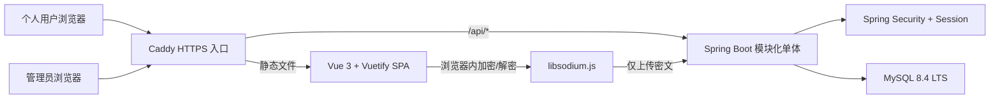
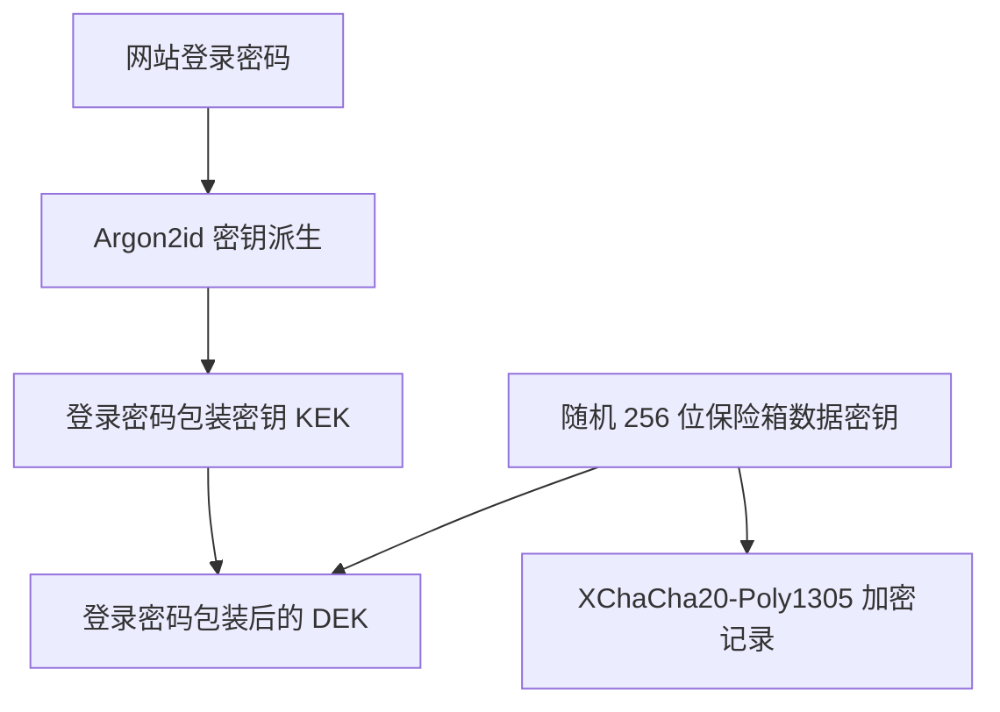

# 在线账密保险箱技术选型与架构设计 v1.0

> 文档状态：第一版技术基线  
> 编制日期：2026-07-20  
> 对应需求：[在线账密保险箱-产品需求文档-v1.0.md](./在线账密保险箱-产品需求文档-v1.0.md)  
> 适用范围：第一版开发、测试与单机生产部署

## 1. 文档目的

本文档确定在线账密保险箱第一版的技术栈、系统边界、安全模型、工程结构和部署方案，作为后续数据库设计、接口设计和项目初始化的依据。

本项目保存密码、密钥、2FA 种子等高敏感数据，技术选型首先保证以下目标：

- 多个个人用户的数据严格隔离。
- 管理员可以管理用户和系统配置，但不能读取用户账密明文。
- 账密内容在浏览器端加密，后端和数据库只保存密文。
- 个人用户入口与管理员入口分别展示，并在后端实施真实权限隔离。
- 动态字段、来源渠道和模板可以持续扩展。
- 第一版架构简单可控，可以在 Windows 开发并部署到 Linux/Docker 环境。

## 2. 总体结论

第一版采用“前后端分离 + 模块化单体 + 同源部署”架构。

| 层级 | 选型 | 第一版定位 |
|---|---|---|
| Java 运行环境 | Java 25 LTS | 后端生产基线 |
| 构建工具 | Maven Wrapper | 固定 Maven 版本并统一构建命令 |
| 后端框架 | Spring Boot 4.1.x、Spring MVC | REST API 和业务服务 |
| 认证授权 | Spring Security 7.1.x | 必须使用，由 Spring Boot BOM 管理版本 |
| 会话 | Spring Session JDBC | Session 存入 MySQL，支持后台撤销和后续多实例 |
| 数据访问 | Spring Data JPA | 业务实体持久化和事务管理 |
| 数据库迁移 | Flyway | SQL 版本迁移，禁止生产自动改表 |
| 数据库 | MySQL 8.4.x LTS、InnoDB | 用户、密文、会话和安全元数据 |
| 前端框架 | Vue 3、TypeScript、Vite | 单页应用 |
| UI | Vuetify 4 | 用户端与管理端组件体系 |
| 前端路由 | Vue Router | 登录、用户端和管理端路由 |
| 前端状态 | Pinia | 仅保存会话视图状态和内存中的解锁状态 |
| 契约校验 | Jakarta Validation、Zod | 后端请求校验和前端动态数据校验 |
| 浏览器端加密 | libsodium.js | Argon2id、XChaCha20-Poly1305 和安全随机数 |
| 后端测试 | JUnit 5、Spring Security Test、Testcontainers | 单元、权限和 MySQL 集成测试 |
| 前端测试 | Vitest、Vue Test Utils、Playwright | 组件、密码学和浏览器端到端测试 |
| 部署 | Docker Compose、Caddy | 容器编排、HTTPS、静态资源和反向代理 |

### 2.1 必须增加的技术组件

在用户指定的 Java、Spring Boot、MySQL 8、Vue 和 Vuetify 之外，第一版必须增加：

- Spring Security：认证、授权、CSRF、会话和安全响应处理。
- Spring Session JDBC：统一保存和撤销登录会话。
- Spring Data JPA：数据访问和事务。
- Flyway：数据库结构迁移。
- Jakarta Validation：后端参数校验。
- Vue Router、Pinia、Zod：前端路由、状态和数据校验。
- libsodium.js：浏览器端账密加密。
- 前后端自动化测试组件。
- Docker Compose 与 HTTPS 入口。

### 2.2 第一版不引入

| 技术 | 暂不引入原因 |
|---|---|
| 自研轻量认证框架 | 安全边界复杂，维护风险高于收益 |
| JWT 登录令牌 | 同源网站更适合 HttpOnly Session Cookie，避免长期令牌进入浏览器存储 |
| WebFlux | 第一版没有响应式流处理需求，Spring MVC 更直接 |
| Redis | 单机阶段由 MySQL 保存会话和限流状态即可 |
| 微服务 | 当前业务规模不需要分布式复杂度 |
| 消息队列 | 第一版没有必须异步解耦的大规模任务 |
| Elasticsearch | 服务端无法搜索用户加密后的标题和字段，第一版使用客户端搜索 |
| Kubernetes | 单机 Docker Compose 足够 |
| Nuxt/SSR | 保险箱不依赖 SEO，敏感数据只能在浏览器解密 |
| 短信服务 | 第一版注册不发送短信验证码 |

## 3. 系统架构



核心边界：

- Caddy 对外提供唯一 HTTPS 入口。
- Vue 静态文件和 `/api/*` 使用同一域名，避免跨域 Cookie 复杂度。
- Spring Boot 只处理认证、密文存储、同步、模板、管理和审计。
- 用户账密的加密和解密只在浏览器内发生。
- MySQL 不保存用户账密明文或可直接解密保险箱的密钥材料。

## 4. 后端技术方案

### 4.1 Java 与 Spring Boot

- 使用 Java 25 LTS。
- 使用 Spring Boot 4.1.x，补丁版本通过项目升级流程更新。
- 使用 Spring MVC，不使用 WebFlux。
- 使用 Maven Wrapper，开发和 CI 统一执行 `mvnw.cmd` 或 `./mvnw`。
- 版本由 Spring Boot BOM 统一管理，避免手动拼装不兼容的 Spring 组件版本。
- DTO 优先使用 Java `record`；第一版不强制引入 Lombok 和 MapStruct。

### 4.2 后端依赖清单

建议的 Maven 依赖如下：

```text
spring-boot-starter-web
spring-boot-starter-security
spring-boot-starter-data-jpa
spring-boot-starter-validation
spring-boot-starter-actuator
spring-session-jdbc
mysql-connector-j
flyway-core
flyway-mysql

spring-boot-starter-test
spring-security-test
testcontainers-junit-jupiter
testcontainers-mysql
archunit-junit5（建议）
```

第一版注册不使用短信验证码，也没有已验证邮箱，因此 `spring-boot-starter-mail` 不作为 P0 依赖。后续增加邮件通知或邮箱找回后再引入。

### 4.3 模块划分

后端采用模块化单体和按业务能力分包：

```text
com.onlineword
├─ auth           注册、个人用户登录、退出、会话
├─ admin          管理员登录、用户管理、邀请码、系统设置
├─ vault          保险箱密钥信封、密文记录、同步和版本冲突
├─ template       系统模板、私人模板和模板快照
├─ audit          登录及管理操作的安全审计
├─ security       SecurityFilterChain、认证提供器、CSRF、限流
└─ common         错误模型、时间、ID、通用基础设施
```

每个业务包内部可以按 `controller / application / domain / infrastructure` 分层。Controller 不直接访问 Repository，防止授权规则散落在接口层。

## 5. Spring Security 方案

### 5.1 为什么必须使用

Spring Security 负责网站身份认证和访问授权，包括：

- 个人用户与管理员的登录认证。
- `/api/v1/**` 和 `/api/admin/v1/**` 的角色隔离。
- Session 固定攻击防护和登录会话管理。
- CSRF 防护。
- 密码安全哈希。
- 管理员多因素认证接入。
- 用户禁用、会话撤销和统一未授权响应。

不能用普通拦截器、自定义 Token 或仅靠前端路由守卫代替 Spring Security。

### 5.2 账户模型

建议分别建立个人用户和管理员账户表：

- `app_user`：个人用户，只能访问自己的保险箱接口。
- `admin_user`：管理员，只能访问管理接口，默认不具有个人用户角色。

后端配置两个认证提供器和两组登录接口，避免管理员账号被当作个人用户登录：

```text
POST /api/auth/register
POST /api/auth/login
POST /api/auth/logout
GET  /api/auth/session

POST /api/admin/auth/login
POST /api/admin/auth/logout
GET  /api/admin/auth/session
```

前端入口分别为：

```text
/login
/register
/admin/login
```

管理员角色不能天然继承个人用户角色，管理员接口也不能提供读取用户密文记录的通用能力。

### 5.3 第一版注册

注册请求字段：

```json
{
  "phone": "手机号",
  "username": "用户名",
  "password": "网站登录密码",
  "confirmPassword": "确认密码"
}
```

实现规则：

- 手机号标准化后唯一，数据库建立唯一索引。
- 用户名进行统一规范化后唯一，数据库建立唯一索引。
- `confirmPassword` 只参与请求校验，绝不保存到数据库。
- 第一版不发送短信验证码，`phone_verified` 固定为 `false`。
- 未验证手机号不能作为可信密码找回凭证。
- 若开启邀请码注册，注册事务同时校验并消耗邀请码。
- 注册接口进行 IP、手机号和用户名维度的频率限制。
- 是否支持“手机号或用户名登录”仍属于产品确认项；接口内部建议使用统一 `identifier` 字段，为两种方式预留兼容能力。

### 5.4 登录密码

- 网站登录密码用于身份认证，并在客户端派生保险箱 KEK（合并原「主密码」域）。
- 使用 Spring Security `DelegatingPasswordEncoder`。
- 第一版使用 Spring Security 管理的 BCrypt 哈希，并配置合理的工作因子。
- 数据库只保存带算法标识的密码哈希，不保存密码明文、加密密码或确认密码。
- 后续可以升级密码算法，并在用户成功登录时逐步重哈希。
- 忘记密码走密保问题；本轮不做短信/邮箱重置。

### 5.5 Session 与 Cookie

- 使用服务端 Session，不把 JWT 保存到 `localStorage`。
- Session 通过 Spring Session JDBC 存入 MySQL。
- Cookie 必须设置 `HttpOnly`、`Secure` 和 `SameSite=Lax`。
- 登录成功后更换 Session ID。
- 支持后台撤销指定用户全部会话；密保重置登录密码后同步吊销会话。
- 网站登录会话过期后需重新登录；**不提供**保险箱独立自动锁定。
- 前端不得使用 Pinia 持久化插件保存解密数据或登录密码。

### 5.6 CSRF

- Spring Security 保持 CSRF 开启，并采用 SPA 配置。
- 前端启动时从 `/api/csrf` 获取 Token。
- `POST`、`PUT`、`PATCH`、`DELETE` 请求通过请求头提交 CSRF Token。
- 登录成功和退出后重新获取 Token。
- 登录和退出接口本身也必须接受 CSRF 校验。

### 5.7 管理员二次验证

- 管理员登录必须启用第二因素。
- 第一版优先采用认证器应用 TOTP，不使用短信验证码。
- Spring Security 管理认证阶段和因子权限；TOTP 生成与校验依赖在原型阶段确定维护良好的 RFC 6238 库，不手写密码学实现。
- 管理员 TOTP 秘钥需要服务端验证，因此使用应用级密钥加密后保存；应用级密钥放在部署 Secret 中，不写入数据库和代码仓库。
- 用户账密中的 TOTP 种子与管理员 MFA 不同，前者仍然只在用户浏览器内解密和计算。

## 6. 前端技术方案

### 6.1 基础选型

- Vue 3 Composition API。
- TypeScript 严格模式。
- Vite 负责开发服务器和生产构建。
- Vuetify 4 负责布局、表单、数据表格、对话框和响应式适配。
- Vue Router 负责个人用户和管理员路由。
- Pinia 负责当前会话、页面状态和临时内存状态。
- Zod 负责注册表单、动态字段、模板和加密载荷结构校验。
- 网络层使用封装后的原生 `fetch`，统一处理 Cookie、CSRF、错误模型和请求超时，第一版不必额外引入 Axios。

### 6.2 前端依赖清单

```text
vue
vuetify
vue-router
pinia
zod
libsodium-wrappers-sumo

vite
typescript
vue-tsc
vitest
@vue/test-utils
playwright
```

使用 Node.js 24 LTS 作为前端构建环境。依赖版本写入 `package-lock.json`，CI 禁止使用未锁定的 `latest` 版本。

### 6.3 前端模块

```text
src
├─ api             fetch 封装、CSRF、错误处理
├─ crypto          密钥派生、密钥包装、记录加解密、TOTP
├─ features
│  ├─ auth         注册、个人登录、会话
│  ├─ vault        账密列表、编辑、搜索、解锁
│  ├─ template     动态字段和模板
│  └─ admin        管理员登录和后台功能
├─ layouts         用户布局、管理员布局、认证布局
├─ router          路由定义与角色守卫
├─ stores          非持久化业务状态
├─ components      通用组件
└─ schemas         Zod 数据结构
```

### 6.4 前端安全约束

- 不使用 `v-html` 渲染用户输入。
- 保险箱页面不加载第三方统计、广告、客服或远程脚本。
- 严格配置 CSP；libsodium.js 的 WebAssembly 加载只允许所需的 `wasm-unsafe-eval`，不得放宽为 `unsafe-eval`。
- 登录密码、解密后的记录只保存在必要的内存生命周期内。
- 退出、主动锁定和自动锁定时清理前端敏感状态。
- JavaScript 无法绝对保证内存清零，因此要缩短明文生命周期并降低 XSS 风险。
- `localStorage`、`sessionStorage`、IndexedDB、URL、错误日志和埋点中都不能出现账密明文。

## 7. 浏览器端加密方案

### 7.1 密钥模型



实现原则：

1. 浏览器首次初始化保险箱时生成随机 256 位数据密钥 DEK。
2. 使用 Argon2id 从**登录密码**派生包装密钥 KEK（DB 列名可仍为 `wrapped_dek_master*`）。
3. 用 KEK 加密包装 DEK，服务端只保存包装结果、盐和 KDF 参数。
4. `wrapped_dek_recovery*` 仅兼容写库，不向用户提供恢复密钥。
5. 每条账密记录使用 DEK 和随机 192 位 nonce 通过 XChaCha20-Poly1305 加密。
6. 记录 ID、所有者标识和载荷版本写入关联数据，防止密文被替换到其他上下文。
7. 密保答案只存哈希，不参与 DEK 解包；密保重置登录密码后清除保险箱数据并重新初始化。

登录成功后客户端自动用登录密码解包 DEK；**无独立解锁门禁**。退出登录清除内存 DEK。

### 7.2 加密载荷

以下内容整体序列化为带版本的 JSON 后加密：

- 记录名称。
- 平台、渠道和标签。
- 所有动态字段名称、类型和值。
- 备注、链接、2FA 种子和使用说明。
- 模板快照。

服务端仅保留：

- 所有者 ID。
- 密文、nonce、算法版本和载荷版本。
- 乐观锁版本。
- 创建、更新时间和删除状态。

因为标题和标签也被加密，第一版搜索在浏览器解密后完成。后续若需要服务端密文索引，必须单独评估信息泄露风险，不能直接上传明文搜索字段。

## 8. MySQL 方案

### 8.1 基础配置

- 使用 MySQL 8.4.x LTS 最新已验证补丁版本。
- 存储引擎使用 InnoDB。
- 字符集使用 `utf8mb4`。
- 应用、数据库和日志统一使用 UTC，界面按用户时区展示。
- 时间字段使用 `DATETIME(6)`。
- 密文使用 `LONGBLOB`，nonce 使用 `BINARY(24)`。
- 数据库只允许后端服务访问，不直接暴露公网端口。

### 8.2 核心表建议

| 表 | 用途 | 敏感边界 |
|---|---|---|
| `app_user` | 手机号、用户名、登录密码哈希、状态 | 不包含保险箱主密码 |
| `admin_user` | 管理员身份和密码哈希 | 与个人用户分离 |
| `admin_mfa` | 管理员 MFA 配置 | TOTP 密钥需应用级加密 |
| `registration_invite` | 邀请码及使用状态 | 只保存邀请码哈希或不可直接滥用的数据 |
| `vault_key_bundle` | 包装后的 DEK、盐、KDF 和算法参数 | 不能单独解密保险箱 |
| `vault_item` | 用户账密密文和同步版本 | 不保存标题、标签或字段明文 |
| `system_template` | 管理员发布的系统模板 | 不包含用户数据 |
| `private_template` | 用户私人模板密文 | 按所有者隔离 |
| `audit_event` | 登录和管理操作安全元数据 | 禁止记录账密值和敏感请求体 |
| `login_attempt` | 登录与注册限流计数 | 定期清理，避免长期保留原始 IP |
| `SPRING_SESSION*` | Spring Session JDBC 表 | 仅后端访问 |

### 8.3 多用户数据隔离

MySQL 没有 PostgreSQL 风格的通用行级安全策略，因此采用多层防护：

- 所有用户私有表必须包含 `owner_id`。
- `owner_id` 只能从 Spring Security 当前认证身份获取，不能信任请求体或 URL 传入的用户 ID。
- Repository 必须使用 `findByIdAndOwnerId` 一类所有者限定查询。
- 禁止在个人用户业务中调用无所有者条件的通用 `findById`。
- 子表使用 `(owner_id, parent_id)` 复合外键或等价约束，防止跨用户关联。
- 写操作同时校验记录 ID、所有者和乐观锁版本。
- 使用 ArchUnit 或代码规范测试，禁止 Controller 直接访问 Repository。
- 自动化测试必须包含用户 A 尝试读取、修改、删除用户 B 数据的反向用例。
- 管理员不获得访问 `vault_item` 明文的接口；即使直接查询数据库也只能得到密文。

### 8.4 迁移与 ORM

- 所有表、索引和约束通过 `src/main/resources/db/migration` 中的 Flyway SQL 管理。
- 开发和生产均执行 Flyway 迁移。
- Hibernate 设置为 `ddl-auto=validate`。
- 禁止在生产使用 `update`、`create` 或 `create-drop`。
- 每次迁移通过 MySQL 8.4 Testcontainers 进行全新建库和升级路径测试。
- 多设备并发编辑使用 JPA `@Version` 或等价版本字段，冲突返回明确的 `409 Conflict`。

## 9. API 设计约定

- API 使用 JSON 和 UTF-8。
- 个人用户接口前缀：`/api/v1/**`。
- 管理接口前缀：`/api/admin/v1/**`。
- 认证接口位于 `/api/auth/**` 和 `/api/admin/auth/**`。
- 接口不接受客户端传入的 `ownerId` 作为授权依据。
- 使用统一错误结构，包括错误码、用户可读消息和请求追踪 ID。
- 生产错误不得返回堆栈、SQL、密码哈希、手机号完整值或密文载荷。
- 幂等操作使用清晰的 HTTP 方法和状态码。
- 版本冲突返回 `409`，未认证返回 `401`，无权限返回 `403`。
- 日志默认不记录请求体和响应体。

## 10. 测试方案

### 10.1 后端

- JUnit 5：业务单元测试。
- Spring Boot Test：应用集成测试。
- Spring Security Test：角色、CSRF、Session 和方法授权测试。
- Testcontainers MySQL：使用真实 MySQL 8.4 验证 JPA、Flyway、唯一约束和事务。
- ArchUnit：验证 Controller、Service、Repository 和私有数据访问边界。

必须覆盖：

- 手机号和用户名重复注册。
- 密码与确认密码不一致。
- 未验证手机号不能找回密码。
- 用户 A 无法读取、修改或删除用户 B 的任何数据。
- 管理员无法进入个人保险箱 API。
- 禁用用户和撤销 Session 后立即失效。
- CSRF 缺失或错误时写请求失败。
- 多设备同时修改时产生版本冲突。

### 10.2 前端

- Vitest：工具函数、Pinia 和密码学封装测试。
- Vue Test Utils：注册、登录、动态字段和 Vuetify 组件测试。
- Playwright：Chromium、Firefox、WebKit 和移动端视口端到端测试。
- 使用官方测试向量验证 Argon2id、XChaCha20-Poly1305 和 TOTP。

必须覆盖：

- 注册、登录、初始化保险箱和退出完整流程。
- 加密后数据库/API 中不出现记录明文。
- 错误登录密码不能解密。
- 密保重置登录密码后保险箱数据被清除，须重新初始化。
- 页面刷新和退出后明文状态被清理。
- Vuetify 动态表单在电脑和手机端可用。
- CSP 下 libsodium.js WebAssembly 正常加载。

## 11. 部署方案

第一版采用 Docker Compose：

```text
caddy       HTTPS、Vue 静态文件、/api 反向代理
backend     Spring Boot 应用
mysql       MySQL 8.4 LTS，仅内部网络访问
```

部署要求：

- Caddy 终止 HTTPS，并统一提供前端与 API 同源访问。
- MySQL 不映射公网端口。
- 数据库密码、Session 配置、管理员 MFA 加密密钥使用 Secret 或部署环境注入。
- 任何真实 Secret 不提交到 Git，也不写入镜像。
- Actuator 只暴露必要的健康检查，并限制为内部网络或单独管理端口。
- 容器设置健康检查和启动依赖。
- MySQL 数据卷定期备份，并执行真实恢复演练。
- 生产环境固定经过验证的镜像版本或 digest，不直接使用浮动 `latest`。

## 12. 日志与审计

- 使用 Spring Boot 默认 SLF4J/Logback 体系。
- 每个请求生成追踪 ID。
- 登录、登录失败、管理员操作、用户禁用、会话撤销和模板发布进入审计日志。
- 手机号只记录脱敏值，例如保留末四位。
- 禁止记录密码、确认密码、登录密码、Cookie、Authorization、TOTP 秘钥、账密字段和解密内容。
- 日志脱敏是第二道防线，第一原则是敏感数据不进入日志调用。
- 审计日志与普通运行日志设置不同的保留周期和访问权限。

## 13. 建议项目结构

```text
online-word
├─ backend
│  ├─ pom.xml
│  ├─ mvnw
│  ├─ mvnw.cmd
│  └─ src
│     ├─ main/java/com/onlineword
│     ├─ main/resources
│     │  └─ db/migration
│     └─ test
├─ frontend
│  ├─ package.json
│  ├─ package-lock.json
│  ├─ vite.config.ts
│  └─ src
├─ deploy
│  ├─ compose.yaml
│  ├─ Caddyfile
│  └─ env.example
├─ docs
└─ README.md
```

现有需求和技术文档可以先保留在项目根目录，初始化代码时再统一移动到 `docs`，避免当前链接失效。

## 14. 版本管理策略

- Java 固定为 25 LTS，不在同一开发周期跨 Java 大版本升级。
- Spring Boot 固定在 4.1.x 系列，安全补丁通过评审后更新。
- Spring Security、Spring Data 和 Spring Session 由 Spring Boot BOM 管理。
- MySQL 固定 8.4 LTS 分支，生产镜像固定已验证补丁版。
- Vuetify 固定 4.x；因当前主版本较新，先完成关键组件原型。
- npm 依赖提交 `package-lock.json`，CI 使用 `npm ci`。
- Maven 使用 Wrapper，前后端构建环境都在 CI 中固定。
- 每月检查安全更新；升级必须通过单元测试、集成测试和端到端测试。

## 15. 开发前必须完成的技术原型

| 原型 | 验证目标 | 通过标准 |
|---|---|---|
| Java/Spring 基线 | Java 25、Boot 4.1、Flyway、MySQL 8.4 兼容 | 完整构建和 Testcontainers 测试通过 |
| Spring Security SPA | JSON 登录、Session、CSRF、退出和双入口 | 正常流程与反向权限测试通过 |
| 管理员 TOTP | 管理员强制第二因素 | 无第二因素不能进入任何管理接口 |
| 浏览器密码学 | libsodium.js、Argon2id、XChaCha20 | 三类浏览器和目标手机性能可接受 |
| CSP | 严格 CSP 与 WASM 同时工作 | 不启用 `unsafe-eval` 仍可解锁保险箱 |
| Vuetify 动态表单 | 动态字段、拖动排序、移动端编辑 | 关键交互无组件阻塞 |
| 多用户隔离 | JPA 所有者限定和复合约束 | 全部跨用户反向测试返回 403/404 |
| 数据恢复 | MySQL 备份和加密备份恢复 | 在空白环境中成功恢复并解密 |

## 16. 第一版验收门槛

技术实现至少满足以下条件才能进入正式使用：

1. Spring Security 保护所有非公开接口，默认未匹配接口拒绝访问。
2. 个人用户和管理员采用独立登录入口与后端角色校验。
3. 手机号、用户名唯一，确认密码不落库，第一版不发送短信验证码。
4. 用户账密只在浏览器内加解密，服务器日志和数据库中不存在明文。
5. 管理员不能通过正常接口读取任何用户账密内容。
6. 所有用户私有查询包含当前认证用户的 `owner_id`。
7. CSRF、Session 撤销、登录限流和管理员二次验证有效。
8. MySQL 迁移、备份和恢复经过测试。
9. Chromium、Firefox、WebKit 和移动端关键流程通过。
10. 生产环境使用 HTTPS、固定版本镜像和外部 Secret。

## 17. 待确认事项

以下事项不会阻塞项目骨架初始化，但应在对应功能开发前确定：

- 个人用户登录使用用户名、手机号，还是两者都支持；技术上推荐统一 `identifier` 并支持两者。
- 第一版保持邀请码注册，还是直接开放注册。
- 未验证手机号条件下的网站登录密码找回流程。
- 管理员 TOTP 使用的具体 Java 库及密钥轮换方案。
- 保险箱默认自动锁定时间。
- 正式域名、服务器规格和备份存储位置。
- 单机用户量达到什么阈值后引入 Redis 和多实例部署。

## 18. 官方参考资料

- [Spring Boot System Requirements](https://docs.spring.io/spring-boot/system-requirements.html)
- [Spring Security Reference](https://docs.spring.io/spring-security/reference/)
- [Spring Security Session Management](https://docs.spring.io/spring-security/reference/servlet/authentication/session-management.html)
- [Spring Security SPA CSRF](https://docs.spring.io/spring-security/reference/7.0/servlet/exploits/csrf.html)
- [Spring Session JDBC](https://docs.spring.io/spring-session/reference/configuration/jdbc.html)
- [Spring Data JPA](https://docs.spring.io/spring-data/jpa/reference/)
- [Java SE Support Roadmap](https://www.oracle.com/java/technologies/java-se-support-roadmap.html)
- [MySQL 8.4 LTS Releases](https://dev.mysql.com/doc/refman/8.4/en/mysql-releases.html)
- [MySQL 8.4 Release Notes](https://dev.mysql.com/doc/relnotes/mysql/8.4/en/)
- [Vue TypeScript Guide](https://vuejs.org/guide/typescript/overview)
- [Vuetify Installation](https://vuetifyjs.com/en/getting-started/installation/)
- [libsodium Password Hashing](https://doc.libsodium.org/password_hashing)
- [libsodium XChaCha20-Poly1305](https://doc.libsodium.org/secret-key_cryptography/aead/chacha20-poly1305/xchacha20-poly1305_construction)
- [RFC 9106: Argon2](https://www.rfc-editor.org/rfc/rfc9106)
- [RFC 6238: TOTP](https://www.rfc-editor.org/rfc/rfc6238)
- [Testcontainers MySQL](https://java.testcontainers.org/modules/databases/mysql/)
- [Playwright](https://playwright.dev/docs/intro)
- [Caddy HTTPS](https://caddyserver.com/docs/quick-starts/https)

