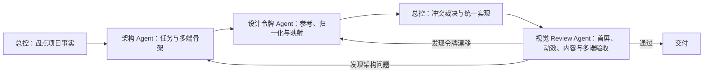

# Online Safe 多智能体前端设计与优化方案 v1.0

## 1. 方案结论

Online Safe 采用“一个总控 + 三个专业 Agent”的串行交接模式：

三个专业 Agent 不同时修改全局主题、共享样式或 `Design.md`。它们先提交结构化结果，由总控统一决策和落盘；Review Agent 默认只读。这样既保留多智能体速度，又避免同一令牌被多次覆盖。

## 2. 三套工具的真实定位

| 工具 | 在方案中的角色 | 主要价值 | 不能承担的工作 |
| --- | --- | --- | --- |
| `ui-ux-pro-max-skill` | 架构 Agent 的设计知识检索器 | 产品/行业候选、设计旋钮、UX 反模式、技术栈和响应式检查 | 不会自动理解项目路由、权限、Vuetify 组件或现有 `Design.md`；推荐不是最终决策 |
| `awesome-design-md` | 设计语言参考库 | 提供颜色、字体、间距、圆角、组件状态等 DESIGN.md 表达方式 | 不是统一变量包；不能直接复制品牌色、Logo、图片、专有字体或整套品牌外观 |
| `frontend-design` | 视觉与动效审查方法 | 单一视觉方向、一个差异化动作、内容纪律、令牌忠实度 | 已有品牌项目不能强行改套它的预设视觉锚点 |

本地试跑 `ui-ux-pro-max-skill` 时，它为保险箱推荐了深色背景、绿色 CTA 和 Fira Code 标题。这与 Online Safe 已确认的浅蓝金融信任方向冲突，证明所有自动推荐只能进入候选/冲突矩阵，不能直接覆盖项目规范。

## 3. 统一决策优先级

发生冲突时按以下顺序裁决：

1. 用户明确要求、产品需求、安全、隐私和权限边界。
2. 项目 `AGENTS.md`、[Design.md](Design.md) 和无障碍规范。
3. 项目现有 Vue/Vuetify 主题、语义令牌、路由和真实业务内容。
4. 架构 Agent 已确认的信息层级和响应式骨架。
5. 外部设计参考与自动推荐。
6. Agent 自行提出的装饰、动效和“更高级”想法。

任何下位建议都不得覆盖上位事实。若项目已有视觉规范，`frontend-design` 负责审查“是否坚持这一方向”，不再另选一套色板。

## 4. Online Safe 的冻结设计决策

### 4.1 视觉事实源

- 唯一项目事实源：`docs/Design.md` v3.0。
- 视觉方向：金融级信任感。
- 项目锚点：浅蓝灰页面、白色表面、深海军蓝标题和单一信任蓝交互色。
- 唯一差异化动作：三级“蓝调纵深”，即页面 → 卡片 → 浮层的层级变化。
- 外部参考：仅借鉴 `awesome-design-md` 的结构化令牌表达，以及 Stripe 等金融产品的克制层级机制；不复制外部品牌资产或专有字体。

### 4.2 核心令牌

| 语义 | 项目值 | 工程落点 |
| --- | --- | --- |
| 页面背景 | `#F6F9FC` | Vuetify `background`、全局页面背景 |
| 表面 | `#FFFFFF` | 卡片、表单、菜单和弹层 |
| 标题/品牌深色 | `#0A2540` | 标题、导航、认证页品牌区 |
| 主操作/焦点 | `#155EEF` | Vuetify `primary`、按钮、链接、选中态 |
| 主色 hover | `#0E4FD1` | 主按钮 hover |
| 主色浅底 | `#EFF4FF` | 选中项、图标底、信息提示 |
| 正文 | `#425466` | 正文和说明 |
| 次级文字 | `#697386` | 元信息和占位 |
| 边框 | `#E6EBF1` | 输入框、卡片和分隔线 |
| 间距 | 4px 基础网格 | 8/12/16/20/24/32/48px |
| 控件圆角 | 6px | Button、Input、Select |
| 卡片/弹窗圆角 | 10px / 12px | Card / Dialog |
| 动效 | 160–220ms `ease` | 颜色、焦点、L1→L2 层级变化 |

不得在组件内部随意增加“差不多的蓝色”或另一套间距。状态色只服务成功、警告和错误，并同时配合文字或图标。

### 4.3 设计旋钮

架构检索和后续页面设计默认使用：

- `variance: 4/10`：保持可信与现代，避免模板化但不做夸张不对称。
- `motion: 3/10`：只保留状态、焦点和层级动效。
- `density: 7/10`：适合保险箱与后台的信息密度，同时以间距网格避免控件相贴。

旋钮只描述设计强度，不直接改写项目令牌。

## 5. Agent 工作契约

### 5.1 架构 Agent

输入：需求、用户角色、权限边界、路由、现有布局、技术栈、Design.md、目标视口和设计旋钮。

先做项目事实盘点，再调用 `ui-ux-pro-max-skill` 生成候选并查询 Vue、表单、加载、焦点和响应式规则。已有项目禁止直接使用 `--persist` 覆盖规范。

输出：

- 页面/路由与每页第一任务。
- 组件树和复用边界。
- 默认、加载、空、成功、校验、网络错误、无权限、禁用和危险操作状态。
- 手机、平板、桌面的真实重排规则。
- 自动推荐与现有规范的采用/调整/拒绝矩阵。
- 交给设计令牌 Agent 的结构化摘要。

### 5.2 设计令牌 Agent

以项目 `Design.md` 为主参考；外部库只补充缺失机制。

执行：选择参考 → 抽取 → 语义归一化 → 映射到 Vuetify/SCSS → 补齐组件状态 → 记录来源、置信度和冲突。

输出：

- `design-reference-decision.md`：参考选择及采纳/拒绝原因。
- `design-token-mapping.md`：来源令牌 → 项目语义 → Vuetify/SCSS 落点。
- 组件状态矩阵：`default / hover / focus-visible / active / disabled / loading / error / success`。
- 字体授权、品牌资产和未确认项清单。

### 5.3 总控 Agent

总控合并前两份结果，冻结视觉方向、差异化动作、语义令牌、页面骨架、真实文案、安全边界和验收范围。只有总控修改共享主题、全局样式与项目设计规范。

若用户只要求方案，到此交付文档；若用户要求实现，按以下顺序修改：

1. Vuetify 主题和全局语义令牌。
2. 认证/保险箱/管理后台壳层。
3. Button、Input、Select、Card、Dialog 和导航状态。
4. 具体页面和真实业务状态。
5. 响应式重排。
6. 克制动效与细节。

### 5.4 视觉与动效 Review Agent

使用 `frontend-design` 的方法审查现有项目锚点，不另选风格。默认只读。

重点检查：

- 首屏是否清楚呈现“我在哪里、当前任务、下一步、真实异常”。
- 是否出现第二套色板、字体、圆角、阴影或近似硬编码。
- 蓝调纵深是否表现为卡片 L1、hover/菜单 L2、弹窗/抽屉 L3。
- 动效是否解释状态与层级，`prefers-reduced-motion` 下是否取消位移和持续装饰。
- 是否出现假用户、假统计、填充副标题、主题化标准操作、Unicode 图标替代或敏感明文。
- 手机、平板、桌面是否存在横向滚动、控件相贴、文字无意截断或主操作被遮挡。

每条问题必须写成“证据 → 用户影响 → 最小修改建议”。

## 6. 质量闸门

| 闸门 | 通过条件 | 阻断条件 |
| --- | --- | --- |
| G0 输入 | 需求、设计事实源、技术栈、范围和中文编码可正确读取 | 无设计依据或安全边界未知 |
| G1 架构 | 每页第一任务、完整状态和多端重排明确 | 权限/导航含混，移动端只是缩小桌面版 |
| G2 令牌 | 单一方向、来源可追溯、状态齐全 | 第二套主题、近似色泛滥、字体授权未知 |
| G3 首屏/内容 | 当前任务和主操作清楚，文案真实 | 竞争主动作、假数据、填充文案、敏感明文 |
| G4 交互/动效 | 状态反馈稳定，动效短且支持 reduced-motion | 布局跳动、强制视差、动效阻塞操作 |
| G5 响应式/无障碍 | 无横向溢出，焦点、标签、对比度、触控目标合格 | 键盘不可用、焦点不可见、只靠颜色表达 |
| G6 工程证据 | 构建/类型检查通过，关键状态有真实渲染证据 | 仅看源码就声称视觉通过 |

Online Safe 固定检查：

- `390 × 844` 手机。
- `768 × 1024` 平板。
- `1440 × 900` 桌面。
- 常规文字对比度至少 4.5:1；大字号至少 3:1。
- 仅图标按钮有中文可访问名称；移动触控目标优先达到 44×44px。
- 验证默认、加载、空状态、错误、成功、禁用和长文本/高密度场景。

缺少真实截图或浏览器证据时，Review 只能给出 `BLOCKED` 或 `PASS_WITH_WARNINGS`，不能口头判定通过。

## 7. 跨项目复用规则

本方案已封装为全局 Codex Skill：`orchestrate-frontend-design`。

在其他项目使用时：

1. 先让技能识别项目指导文件、技术栈、组件库和已有设计规范。
2. 有成熟 Design.md 时以项目规范为主；没有时才选择外部主参考并建立语义令牌。
3. ui-ux-pro-max 可用时调用真实脚本；不可用时按同样输入输出契约完成架构阶段并明确降级。
4. awesome-design-md 可用时只选一个主参考；不可用时从用户要求和项目现状建立令牌。
5. frontend-design 可用时执行末端审查；已有项目仍以自身锚点为准。
6. 只有用户明确要求实现时才修改代码；审查任务保持只读。

## 8. 本地研究依据

- `D:\Ai\ui-ux-pro-max-skill-main`：设计系统检索、技术栈与 UX 规则。
- `D:\Ai\awesome-design-md-main`：结构化 DESIGN.md 参考库。
- `C:\Users\16133\.codex\skills\frontend-design\SKILL.md`：单一视觉方向、差异化动作、内容纪律和出货检查。
- `docs/Design.md`：Online Safe 当前唯一视觉事实源。

两个外部参考仓库采用 MIT 许可，但这不等于获得其中品牌 Logo、图片、截图或专有字体的授权；本方案只复用通用设计机制与工作流程。

